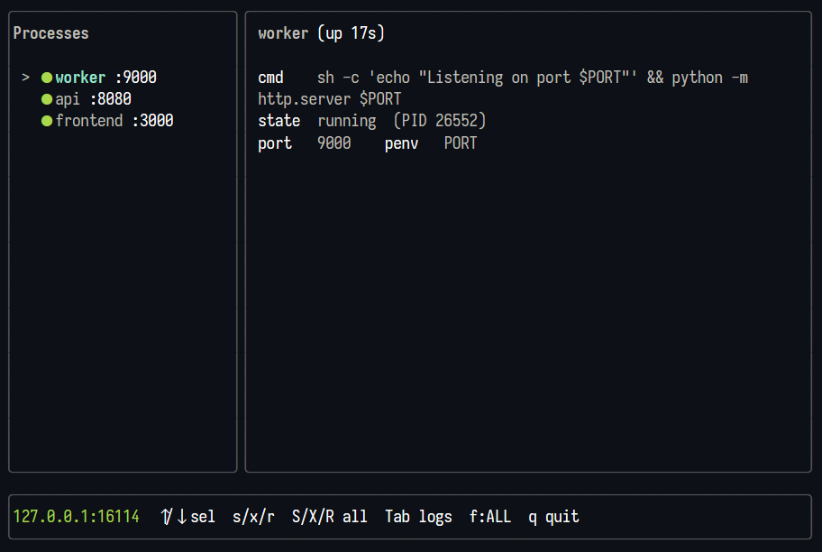
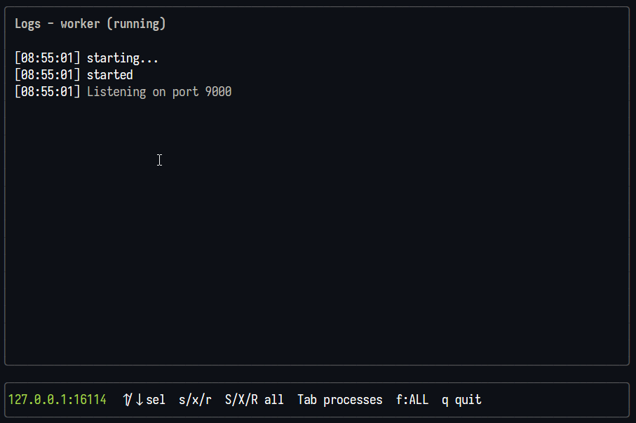

# Invincible

> **Proof of concept.** Invincible is an experiment, not a finished product. APIs, config format, and behaviour WILL change without notice.

A process manager for local development, written in Go.

Keep services alive, restart them on crash, assign free ports automatically, wire up port dependencies, and optionally watch files for auto-rebuild — no Docker required. Comes with a terminal UI for humans and an HTTP API for agents.





## Invincible is Not

- A replacement for `make`
- A replacement for a full process manager like systemd or supervisor
- Intended for production use

## Installation

Requires Go 1.26 or later.

```sh
# Install to $GOPATH/bin
go install github.com/saintedlama/invincible/cmd/invincible@latest
```

## Building from source

```sh
# Or build from source
git clone https://github.com/saintedlama/invincible
cd invincible
go build -o invincible ./cmd/invincible
```

## Quick start

```sh
# Create a starter config in the current directory
invincible init

# Edit invincible.toml, then run
invincible
```

## Configuration

Invincible looks for `invincible.toml` in the current directory by default.

```toml
[project]
name    = "myapp"
# api_addr = ":7777"   # override the HTTP API port (default: path-derived offset from 7777)
# shell    = "auto"    # interpreter for cmd/build: "auto" (bash, or on Windows: pwsh if found else cmd.exe), "cmd", "bash", "pwsh"

[[process]]
name          = "api"
cmd           = "go run ./cmd/api"
cwd           = "./backend"   # working directory for this process
port          = 8080          # hint; Invincible finds the next free port if taken
# port_env    = "PORT"        # env var injected with this process's port (default: PORT)
# no_port     = true          # disable port assignment for this process
# depends_on  = ["worker"]    # restart this process if a dependency changes port
# restart_delay = "500ms"     # wait before restarting after a crash (default: 500ms)
# shutdown_timeout = "500ms"  # SIGTERM grace period before SIGKILL
# env         = { QUEUE = "default" }  # extra static env vars

[[process]]
name = "worker"
cmd  = "go run ./cmd/worker"
# port omitted → Invincible assigns an arbitrary free port
```

### Shell selection

Each `cmd` string and each `build` step is run through an interpreter, chosen by `project.shell`:

| Value | Behavior |
|---|---|
| `auto` (default) | `bash` on Linux/macOS. On Windows: `pwsh` if it's found on `PATH`, otherwise `cmd.exe` |
| `cmd` | `cmd.exe /c "..."` — Windows only |
| `bash` | `bash -c "..."` |
| `pwsh` | `pwsh -NoProfile -Command "..."` — PowerShell **7+** only; Windows PowerShell 5.1 (`powershell.exe`) is not supported, since it predates the `&&`/`||` chain operators `build` steps rely on |

Explicitly setting `shell = "cmd"`, `"bash"`, or `"pwsh"` is deterministic — there's no fallback if that interpreter's binary isn't on `PATH`; the process just fails to start with a normal "executable not found" error. `auto` is the one case that probes for `pwsh` first, since it's a strict upgrade over `cmd.exe` for build-step chaining when it's available.

The default changed in a prior version: Invincible used to prefer a POSIX shell (e.g. Git Bash) over `cmd.exe` whenever one was found on `PATH`. That shell ran non-interactively, so it never sourced `~/.bashrc`/`~/.bash_profile` — tools whose `PATH` entry is only added by a shell profile script (common with `nvm`, Volta, etc.) could go missing even though they work fine in an interactive terminal. `auto` no longer probes for a POSIX shell on Windows; set `shell = "bash"` explicitly if you rely on POSIX syntax in your commands.

### Port assignment

Every process that needs a port gets one automatically:

- If `port` is set, Invincible searches upward from that hint until it finds a free port.
- If `port` is omitted, the OS assigns an arbitrary free port.
- Set `no_port = true` to opt out entirely.

### Port environment variables

Before starting, Invincible injects into every process:

| Variable | Value |
|---|---|
| `PORT` (or `port_env`) | This process's assigned port |
| `<PEER_NAME>_PORT` | One variable per sibling that has a port, e.g. `API_PORT=8080` |

### Dependencies

```toml
[[process]]
name       = "frontend"
cmd        = "..."
depends_on = ["api"]
```

If `api` crashes and gets a **new port**, `frontend` is automatically restarted with the updated `API_PORT`. If the port doesn't change, `frontend` is left alone.

Cycles are detected at startup — Invincible exits with an error if a cycle exists.

### Working directory

Set `cwd` to run a command from a specific directory:

```toml
[[process]]
name = "frontend"
cmd  = "npm run dev"
cwd  = "./frontend"
port = 5173
```

### File watching + auto-restart (opt-in)

When `watch` is configured for a process, Invincible watches the specified directories for file changes and restarts the process. `build` is optional:

- If `build` is set, Invincible runs its steps first and restarts only on success — the old process keeps running if the build fails. Use this for compiled languages (Go, Rust, etc.) that need a build step before the new binary can run.
- If `build` is omitted, Invincible restarts the process directly on file change. Use this for interpreted runtimes (Node, Python, Ruby, etc.) where there's nothing to compile — the process just needs to pick up the new source on the next start.

Watch directories are relative to `cwd` when set, otherwise relative to the project root.

```toml
[[process]]
name  = "api"
cmd   = "./bin/api"
cwd   = "./backend"

# Rebuild and restart on file changes
build           = ["go generate ./...", "go build -o ./bin/api ./cmd/api"]
watch           = ["."]                      # directories to watch
watch_include   = ["*.go", "*.templ"]       # file globs that trigger rebuild (default: all)
watch_exclude   = ["vendor", ".git", "tmp"] # subdirectories to skip
watch_debounce  = "500ms"                   # quiet period before triggering (default: 500ms)

[[process]]
name  = "worker"
cmd   = "python worker.py"
cwd   = "./worker"

# No build step — just restart on file change
watch = ["."]
```

`build` is a list of steps, run in order as **one chained shell invocation** (`step1 && step2 && ...`) rather than as separate processes. That matters because each step is not a persistent shell session on its own — a `cd` only affects the process it runs in, so chaining steps together in a single invocation is what lets a `cd` in one step carry over to the next:

```toml
build = ["cd ./frontend", "npm run build"]
```

On `cmd`, steps are joined without spaces around `&&` (`cd frontend&&npm run build`) — cmd.exe's argument parsing can otherwise fold a trailing space before `&&` into a builtin's argument (e.g. `cd`'s target directory). `bash` and `pwsh` join with spaces (`cd frontend && npm run build`).

The TUI detail panel shows `watch  on` for processes with active file watching. Build output and watch events appear in the process logs with the `invincible` source.

### Kitchen sink example

Every config field in one file, for reference:

```toml
[project]
name     = "myapp"    # optional; display only
api_addr = ":7777"    # override the HTTP API bind address (default: path-derived offset from :7777)
shell    = "auto"     # interpreter for cmd/build: "auto" | "cmd" | "bash" | "pwsh" (default: "auto"; on Windows, "auto" prefers pwsh over cmd.exe if found)

[[process]]
name             = "api"                             # required, must be unique
cmd              = "go run ./cmd/api"                # required
cwd              = "./backend"                       # working directory (default: project root)
port             = 8080                              # port hint; Invincible searches upward for a free port
port_env         = "PORT"                            # env var name for this process's own port (default: "PORT")
no_port          = false                             # true disables port assignment entirely
depends_on       = ["worker"]                        # restart this process if a dependency's port changes
restart_delay    = "500ms"                           # wait before restarting after a crash (default: "500ms")
shutdown_timeout = "500ms"                            # SIGTERM grace period before SIGKILL (default: "500ms")
env              = { QUEUE = "default", LOG_LEVEL = "debug" }  # extra static env vars

# File watching + auto-restart (opt-in; all fields below are optional)
watch          = ["."]                                # directories to watch for changes
watch_include  = ["*.go", "*.templ"]                  # file globs that trigger a restart (default: all files)
watch_exclude  = ["vendor", ".git", "tmp"]             # subdirectories to skip
watch_debounce = "500ms"                               # quiet period before triggering (default: "500ms")
build          = ["go generate ./...", "go build -o ./bin/api ./cmd/api"]  # optional; steps run as one chained shell invocation before restart; omit to restart directly

[[process]]
name    = "worker"
cmd     = "python worker.py"
cwd     = "./worker"
no_port = true    # this process doesn't listen on a port

# Watch without a build step — restarts directly on file change (e.g. interpreted languages)
watch = ["."]
```

## Running

```sh
invincible [flags]

Flags:
  --config    path to config file           (default: invincible.toml)
  --api-addr  preferred HTTP API address    (default: path-derived offset from :7777; falls back to config api_addr)
  --no-tui    run headless, print API URL to stdout
```

### TUI key bindings

Invincible has two screens — **Dashboard** (process list + details) and **Logs** (full-width). Press `Tab` to switch between them.

| Key | Action |
|---|---|
| `Tab` | Toggle between Dashboard and Logs screens |
| `↑` / `k` | Select previous process |
| `↓` / `j` | Select next process |
| `s` | Start selected process |
| `x` | Stop selected process |
| `r` | Restart selected process |
| `S` (Shift+s) | Start all processes |
| `X` (Shift+x) | Stop all processes |
| `R` (Shift+r) | Restart all processes |
| `f` | Cycle log filter (ALL → STDERR → STDOUT → INVINCIBLE) |
| `Shift+↑` / `PgUp` | Scroll logs up |
| `Shift+↓` / `PgDn` | Scroll logs down |
| `q` / `Ctrl+C` | Quit |

### Mouse support

| Action | Area |
|---|---|
| Scroll wheel | Dashboard: over process list → select next/previous process |
| Scroll wheel | Logs screen: scroll logs |

## CLI commands

### `invincible init`

Create a starter `invincible.toml` in the current directory. Exits with an error if one already exists.

### `invincible skill`

Print a quick guide telling you what to paste into an AI agent session to install the Invincible skill.

### `invincible skill-spec`

Print the full skill description (API reference, process schema, workflows) for an agent to consume. Invoke this after the agent has been told to install the skill via `invincible skill`.

## Working with agents across worktrees

When you run Invincible in multiple git worktrees simultaneously, each instance needs a way to find the right API port. Invincible handles this in two ways:

### `.invincible.port` file

On startup, Invincible writes the bound API address (e.g. `127.0.0.1:12583`) to `.invincible.port` in the project root. The file is removed on clean shutdown. Agents can discover the correct instance by reading this file from the worktree they are operating in:

```sh
cat .invincible.port
# → 127.0.0.1:12583
```

### Path-derived port offset

When no explicit `api_addr` is configured (flag or config file), Invincible derives a deterministic port from the project directory path by hashing the absolute path and adding the result as an offset to the base port `7777`. Each worktree gets a different preferred port, so instances rarely collide:

```
/projects/app/main      → offset 1234 → tries :9011
/projects/app/feature-x → offset 7891 → tries :15668
```

If the preferred port happens to be taken, Invincible falls back to an OS-assigned ephemeral port — and still records the actual address in `.invincible.port`.

Run `invincible skill` to see how to install the Invincible agent skill, then `invincible skill-spec` for the full API reference.

## HTTP API

The API binds to `127.0.0.1` and is only accessible locally.

| Method | Path | Description |
|---|---|---|
| `GET` | `/processes` | List all processes |
| `GET` | `/processes/{name}` | Get one process |
| `GET` | `/processes/{name}/logs` | Get recent logs (`?n=100&format=text`) |
| `POST` | `/processes/{name}/start` | Start a process |
| `POST` | `/processes/{name}/stop` | Stop a process |
| `POST` | `/processes/{name}/restart` | Restart a process |
| `GET` | `/openapi.json` | OpenAPI 3.0 spec |

### Process object

```json
{
  "Name":       "api",
  "State":      "running",
  "PID":        1234,
  "Cmd":        "go run ./cmd/api",
  "Cwd":        "./backend",
  "Port":       8080,
  "PortEnv":    "PORT",
  "DependsOn":  ["worker"],
  "Restarts":   0,
  "StartedAt":  "2026-06-04T08:00:00Z",
  "Watching":   true,
  "Env":        { "QUEUE": "default" }
}
```

**States:** `stopped` · `starting` · `probing` · `running` · `building` · `crashed`

`probing` means the process has started but its port has not yet accepted a connection. Once the port is reachable the state transitions to `running`.

### Log entry object

```json
{ "time": "2026-06-04T08:22:01Z", "line": "server started on :8080", "source": "stdout" }
```

Source values: `stdout`, `stderr`, or `invincible` (system events / build output).

Use `?format=text` for plain newline-separated output (no metadata).
